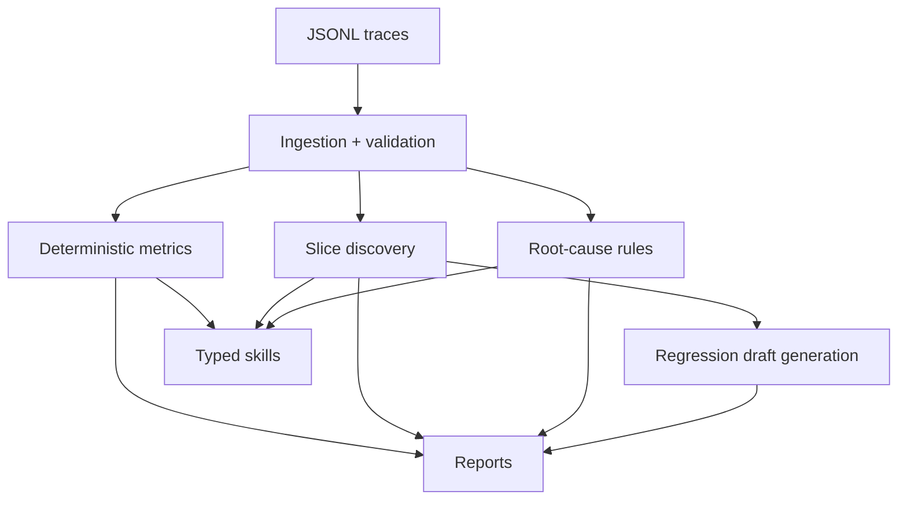

# FailureLab

[](https://github.com/yellepeddibk/failurelab/actions/workflows/ci.yml)


FailureLab is a local-first AI reliability toolkit for deterministic analysis of RAG and agent traces. It finds concentrated failure slices, produces evidence-backed root-cause hypotheses, and drafts regression tests from production failures. Use it as a Python library or through the command line.

## Why FailureLab

Averages can hide failure concentration by model, prompt, retriever, or tool sequence. FailureLab keeps deterministic metric logic in typed services and returns typed report objects you can inspect in code. The CLI is a thin wrapper over the same engine.

## Install

```bash
python -m pip install "failurelab>=0.2.0"
```

The importable Python API described below is available from 0.2.0 onward. Until 0.2.0 is published to PyPI, install from source:

```bash
git clone https://github.com/yellepeddibk/failurelab.git
cd failurelab
python -m pip install .
```

FailureLab supports Python 3.11 to 3.14 and has no LLM, network, or database dependencies.

## Quickstart (Python)

Analyze a collection of traces in memory. Nothing is written to disk unless you call `write`.

```python
import failurelab as fl

traces = [
    {
        "schema_version": "0.1",
        "trace_id": "trace-1",
        "timestamp": "2026-01-01T00:00:00+00:00",
        "success": True,
    },
    {
        "schema_version": "0.1",
        "trace_id": "trace-2",
        "timestamp": "2026-01-01T00:01:00+00:00",
        "success": False,
        "query": "Who owns this incident?",
        "failure_type": "retrieval_failure",
    },
]

report = fl.analyze(traces)

failure_rate = report.metric("failure_rate")
print("failure_rate:", failure_rate.value if failure_rate else None)
print("analyzable:", report.data_quality.analyzable)

# Persistence is explicit and opt-in.
report.write("reports", overwrite=True)
```

`fl.analyze` also accepts a path to a JSONL file, or an iterable of `TraceRecord` objects:

```python
report = fl.analyze("traces.jsonl")
```

### Working with the report

```python
report.metric("failure_rate").value   # a single metric result
report.failure_slices                  # segments with elevated failure
report.root_cause_hypotheses           # per-failed-trace hypotheses
report.to_markdown()                   # the human-readable report as a string
report.to_dict()                       # a JSON-serializable view of everything
```

### Validate input

`validate` inspects the complete input and reports every issue. It never raises for invalid data.

```python
import failurelab as fl

result = fl.validate("traces.jsonl")   # or an iterable of dicts / TraceRecord
print(result.is_valid, result.data_quality.invalid_count)
for issue in result.issues:
    print(issue.row_number, issue.error_type, issue.message)
```

By contrast, `analyze` and `compare` raise `InvalidTraceDataError` in strict mode (the default), and the exception carries the full issue list.

### Compare two runs

```python
import failurelab as fl

comparison = fl.compare("baseline.jsonl", "candidate.jsonl")
print(comparison.gate_status, comparison.gate_passed, comparison.is_comparable)
comparison.write("reports", overwrite=True)
```

Runnable versions of these snippets live in [examples/analyze_in_memory.py](examples/analyze_in_memory.py) and [examples/analyze_from_jsonl.py](examples/analyze_from_jsonl.py).

## Command-line interface

The CLI wraps the same deterministic engine and writes the same report files.

```bash
failurelab --version
failurelab validate examples/rag_traces.jsonl
failurelab analyze examples/rag_traces.jsonl --output reports --overwrite
failurelab compare examples/baseline_traces.jsonl examples/candidate_traces.jsonl --output reports --overwrite
```

## Implemented capabilities

- Importable Python API returning typed, in-memory report objects
- Typed trace and agent-step contracts using Pydantic v2
- Incremental JSONL ingestion with strict and skip-invalid modes
- Deterministic metrics and categorical breakdowns
- Deterministic failure-slice discovery and root-cause heuristics
- Draft regression test generation in YAML
- Compare baseline/candidate runs with deterministic gate checks
- Typer CLI (`validate`, `analyze`, `compare`)
- JSON, Markdown, and YAML report outputs
- Deterministic skills plus an investigation helper that runs a caller-provided sequence of those skills and aggregates the resulting evidence

## Example trace schema (minimal)

```json
{"schema_version":"0.1","trace_id":"rag-001","timestamp":"2026-07-10T10:00:00+00:00","success":true}
```

## Output files

- `metrics.json`
- `findings.json`
- `report.md`
- `regression_tests.yaml`
- `run_manifest.json`
- `invalid_traces.jsonl` (skip-invalid mode)
- `comparison.json`, `comparison.md`, `gate_result.json` (compare)

## Configuration precedence

FailureLab resolves configuration deterministically in this order:

1. built-in defaults
2. config file values (`--config`)
3. explicit CLI overrides (for example `--skip-invalid`, `--retrieval-k`)

`run_manifest.json` records the effective resolved configuration used for execution.

## Metrics notes

Each metric includes value, numerator, denominator, eligibility counts, direction, and unavailable reason when needed. Metrics that require observations are reported as unavailable (`null`) when no eligible observations exist; they are not coerced to `0`.

## Analysis semantics

- Failure slices include only elevated failure segments (positive uplift over global failure rate).
- Root-cause hypotheses are generated only for explicitly failed traces.
- Draft regression cases are generated only from failed traces with concrete replayable input.
- Comparison outputs include full-dataset and matched-ID scopes, plus metric deltas.
- Gate status is tri-state: `not_configured`, `passed`, or `failed`.

## Architecture



## Privacy and limitations

- Local-first, no network calls in core analysis.
- Raw query/context content is excluded from reports by default.
- No significance or causal certainty claims.

## Development

```bash
python -m pip install -e ".[dev]"
ruff check .
ruff format --check .
mypy src
pytest
python -m build
```

## Roadmap (not implemented)

Statistical inference, embedding clustering, calibrated judge models, active learning, external orchestrators, and optional API/storage/dashboard layers.

## Contributing and license

See [CONTRIBUTING.md](CONTRIBUTING.md) and [LICENSE](LICENSE).
