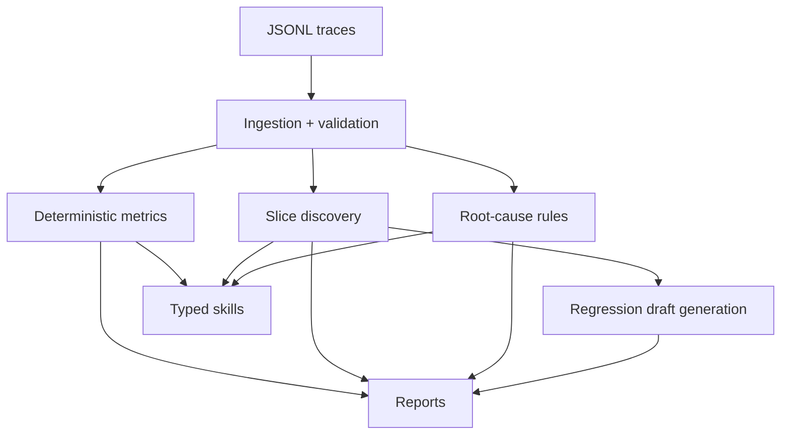

# FailureLab

[](https://github.com/yellepeddibk/failurelab/actions/workflows/ci.yml)


FailureLab is a local-first AI reliability toolkit for deterministic analysis of RAG and agent traces. It finds concentrated failure slices, produces evidence-backed root-cause hypotheses, and drafts regression tests from production failures.

## Why FailureLab

Averages can hide failure concentration by model, prompt, retriever, or tool sequence. FailureLab keeps deterministic metric logic in typed services and allows agent layers to consume those deterministic skills.

## 60-second quickstart

```bash
python -m pip install -e ".[dev]"
failurelab --version
failurelab validate examples/rag_traces.jsonl
failurelab analyze examples/rag_traces.jsonl --output reports --overwrite
failurelab compare examples/baseline_traces.jsonl examples/candidate_traces.jsonl --output reports --overwrite
```

## Implemented capabilities

- Typed trace and agent-step contracts using Pydantic v2
- Incremental JSONL ingestion with strict and skip-invalid modes
- Deterministic metrics and categorical breakdowns
- Deterministic failure-slice discovery and root-cause heuristics
- Draft regression test generation in YAML
- Compare baseline/candidate runs with deterministic gate checks
- Typer CLI (`validate`, `analyze`, `compare`)
- JSON, Markdown, and YAML report outputs
- Deterministic skill interfaces and a routing investigation agent

## Example trace schema (minimal)

```json
{"schema_version":"0.1","trace_id":"rag-001","timestamp":"2026-07-10T10:00:00+00:00","success":true}
```

## Output files

- `metrics.json`
- `findings.json`
- `report.md`
- `regression_tests.yaml`
- `run_manifest.json`
- `invalid_traces.jsonl` (skip-invalid mode)
- `comparison.json`, `comparison.md`, `gate_result.json` (compare)

## Metrics notes

Each metric includes value, numerator, denominator, eligibility counts, direction, and unavailable reason when needed.

## Architecture



## Privacy and limitations

- Local-first, no network calls in core analysis.
- Raw query/context content is excluded from reports by default.
- No significance or causal certainty claims.

## Development

```bash
ruff check .
ruff format --check .
mypy src
pytest
python -m build
```

## Roadmap (not implemented)

Statistical inference, embedding clustering, calibrated judge models, active learning, external orchestrators, and optional API/storage/dashboard layers.

## Contributing and license

See [CONTRIBUTING.md](CONTRIBUTING.md) and [LICENSE](LICENSE).
